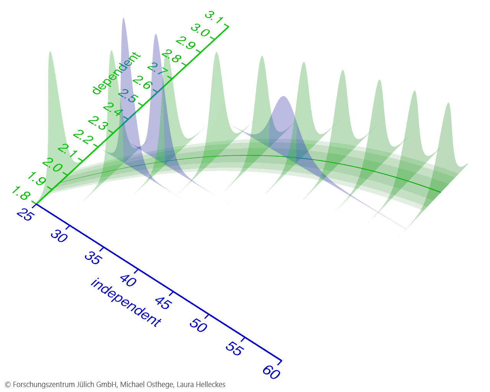

Terminology
-----------
The International Bureau of Weights and Measures (BIPM) defines as calibration as:

    *[A procedure that] establishes a relation between the quantity values [...] provided by measurement standards
    and the corresponding indications with associated measurement uncertainties [...].*

Mathematically, the two quantities are often referred to as *independent* and *dependent* variable.
In a second step, the relation between the two can be used to obtain quantity values of the independent variable from the indications.

   
We use the term *error model* to describe the relationship between independent and dependent variable in a data-generating process. 
The underlying assumption is that for each quantity value of the independent variable, we can describe a probability distribution
over the dependent variable and its measurement uncertainties.
The parameters of the error model describe how this probability distribution changes in dependence on the independent variable.

With ``calibr8``, we provide a Python package to effortlessly construct and apply error models independent of the application domain.
On the following pages, you can read about the concepts of ``calibr8`` and learn how to build you own error models for calibration and modeling.
